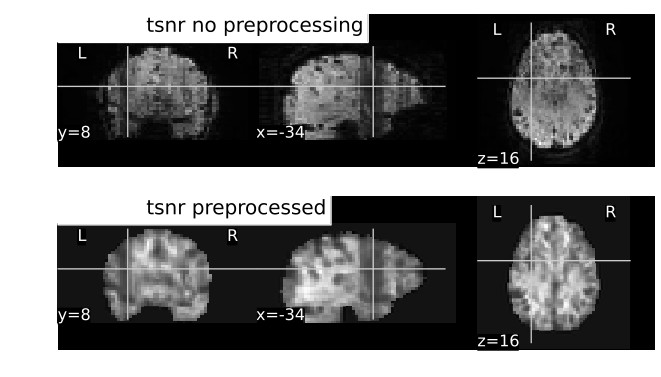
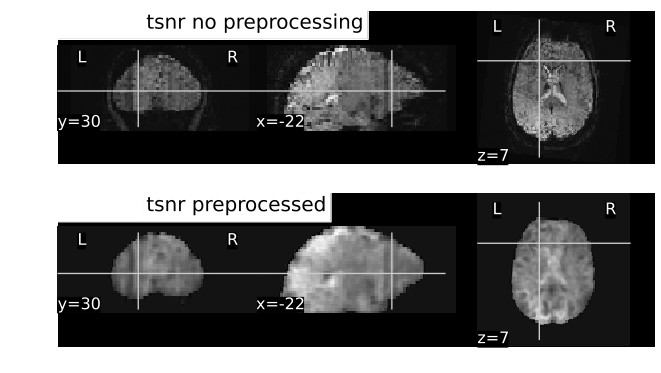
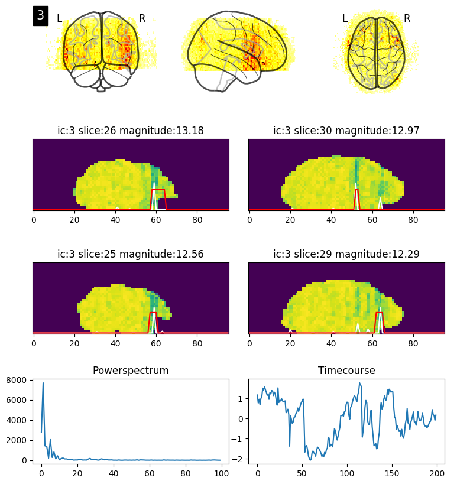
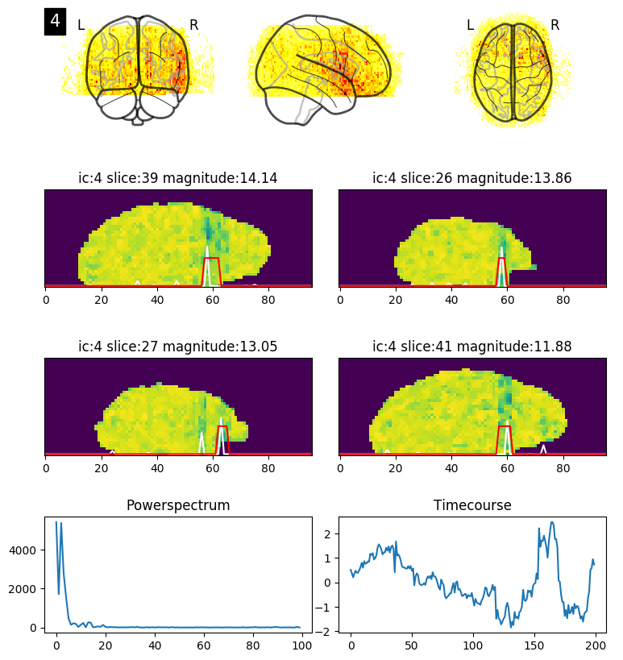

# stripe_cleaning_scripts
Pipeline + miscellaneous scripts to clean fMRI data from "stripe artefact" also referred to as "column artefact" or "pencil beam artefact".

 

## Artefact description
Artefacts are visible as vertical stripes in EPI TSNR (temporal signal-to-noise ratio maps, each voxels time-series mean divided by its standard deviation) or temporal standard deviation maps. Stripes are usually found going bilaterally through middle frontal gyrus to the anterior temporal lobe. But they can also be in other frontal and prefrontal areas of the brain. They are present in raw data, as well as in data preprocessed by a standard pipeline (brain extraction, motion correction, grand mean scaling, spatial smoothing, highpass filter).

## How to look for them
Artefacts are best visible in TSNR maps. TSNR maps can be created in Matlab or python by dividing each voxels time series mean by its standard deviation. Alternatively, they can be created with fslmaths by first creating mean and standard deviation maps and then taking their ratio like this:

    fslmaths epi.nii.gz -Tstd epi_tstd.nii.gz
    fslmaths epi.nii.gz -Tmean epi_tmean.nii.gz
    fslmaths epi_tmean.nii.gz -div epi_tstd.nii.gz epi_tsnr.nii.gz

## Cause and prevention
They are thought to be caused by faulty fat suppression pulse in some types of MRI machines and could be fixed by turning the puls off or by a patch from a manufacturer. This is according to a personal communication with a couple of MR physicists and some ancient post in Dartmouth MR users mailing list, which are no longer accessible. 

## Effect
For GLM based modeling, we expect a significant loss of power in affected areas. For resting state data, artefacts may cause spurious correlations and also a loss of power. 

## Cleaning
It is unknown what's the best way to clean them. However, regressing out independent components before any other preprocessing is done seems to works fine. Optionally, fsl FIX can be used to classify components automatically after only a subset of subjects is classified by hand, however, this might be more complicated and less reliable than just doing it all by hand. Step by step procedure we used is:

For each subject:
1. Run melodic on raw data (no realignment, no smoothing)
2. Classify components to noise and not noise
3. Regress noise components out using fsl regfilt
4. Run rest of the preprocessing pipeline as usual 

Optional: train fsl FIX to classify noise and not noise components and use it's classifications instead of manual ones in step 2

## Plotting of independent components
ica_stripes_plotting.py is a script meant to make classification of ICA components containing stripes easier. For each sagittal slice, it tries to guess if it contains a stripe and then plots 4 slices that score the highest. It is quite good at capturing stripe artifacts, especially big ones (unlike FIX). It can be used to classify components by hand or to double check classification performed by FIX. 

### Plotting script output

